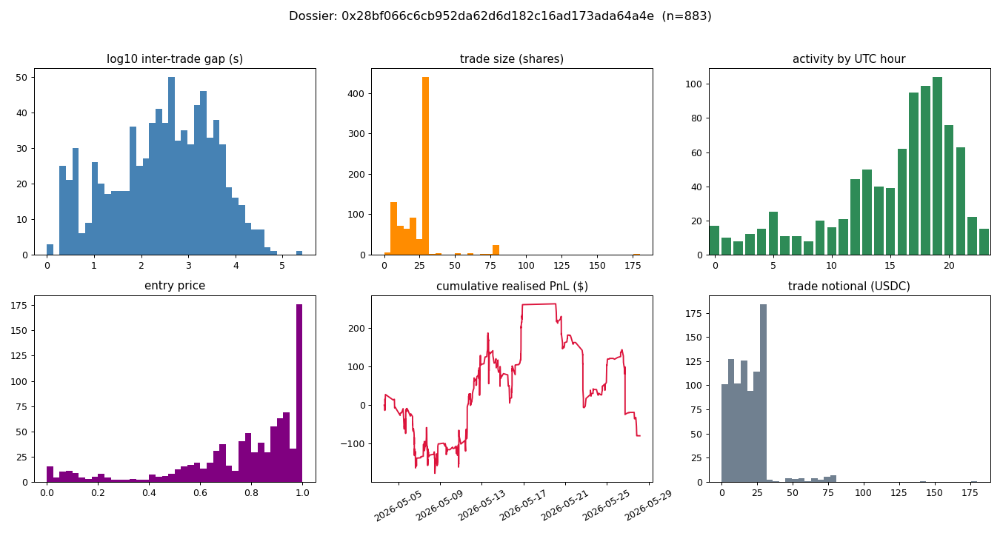

# Dossier — 0x28bf066c6cb952da62d6d182c16ad173ada64a4e

*Type:* wallet | *member wallets:* 1 | *bot_score:* 0.69

## Summary stats
- Trades: **883** | Volume: **$16,555** | Realised PnL (resolved): **$-79** (ROI -0.5%)
- Fill win rate: **0.77** | Breadth: **149 markets** | Active hours: **24/24**
- Active period: 2026-05-03T12:00:00Z … 2026-05-29 | resolution-day trade share: 90%

## Inferred strategy archetype: **Resolution-drift sniper**  _(confidence: medium)_

## Evidence

| signal | value |
|---|---|
| breadth (markets) | 149 |
| active UTC hours | 24/24 |
| cadence cv_gap (min) | 4.014 |
| max fills / second | 6 |
| median size (shares) | 30.0 |
| mode-size fraction | 0.48 |
| reaction alignment | 0.82 |
| resolution-day share | 90% |
| fill win rate | 0.77 |
| ROI on resolved | -0.005 |

Triggers fired: breadth 149 markets, 24/24 active hours, reaction alignment 0.82, 90% trades on resolution day

## Estimated edge source
- High breadth + high win rate + thin ROI ⇒ edge is **many small, high-probability fills** (spread/fair-value capture across all buckets), not a few large directional bets.
## Inferred sizing & timing model _(described, not exact)_
- **Sizing:** median ~30 shares; mode-size fraction 0.48 (variable).
- **Timing:** 24/24 active, up to 6 fills/second ⇒ automated, polling-driven; cadence regularity (cv_gap 4.01).
## Weaknesses / exploitable angles
- Taker-side data hides maker quote/cancel churn — adverse-selection windows are not directly measured here (forward live capture, Phase 8).
- Reaction alignment is measured against an **hourly** reference; any sub-hour staleness after a temperature move is invisible to this proxy.
- High breadth ⇒ thin per-market attention; illiquid buckets / off-peak UTC hours are candidate coverage gaps (quantified in exploits.md).

_Caveats: taker-side only; maker fraction/adverse-selection unavailable; reaction coarse (hourly); operator membership via co-timing._
