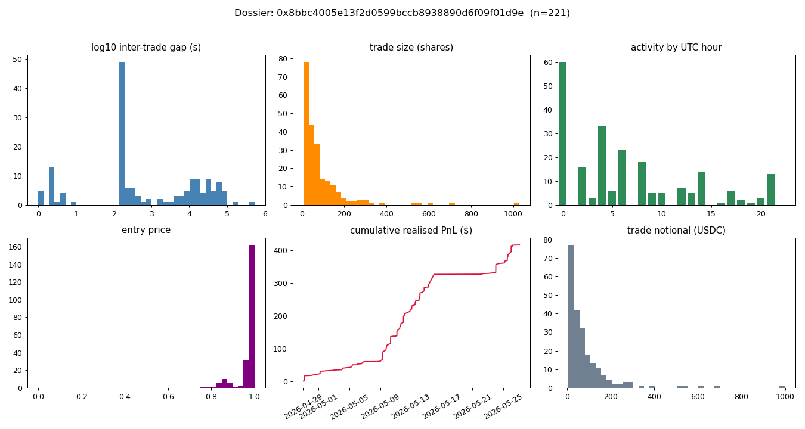

# Dossier — 0x8bbc4005e13f2d0599bccb8938890d6f09f01d9e

*Type:* wallet | *member wallets:* 1 | *bot_score:* 0.51

## Summary stats
- Trades: **221** | Volume: **$19,063** | Realised PnL (resolved): **$418** (ROI 2.4%)
- Fill win rate: **0.99** | Breadth: **58 markets** | Active hours: **18/24**
- Active period: 2026-04-29T12:00:00Z … 2026-05-29 | resolution-day trade share: 24%

## Inferred strategy archetype: **Longshot / tail trader**  _(confidence: medium)_

## Evidence

| signal | value |
|---|---|
| breadth (markets) | 58 |
| active UTC hours | 18/24 |
| cadence cv_gap (min) | 2.895 |
| max fills / second | 4 |
| median size (shares) | 52.0 |
| mode-size fraction | 0.07 |
| reaction alignment | 1.00 |
| resolution-day share | 24% |
| fill win rate | 0.99 |
| ROI on resolved | 0.024 |

Triggers fired: breadth 58 markets, win rate 0.99, thin ROI 0.024, reaction alignment 1.00, extreme-price frac 0.87

## Estimated edge source
- High breadth + high win rate + thin ROI ⇒ edge is **many small, high-probability fills** (spread/fair-value capture across all buckets), not a few large directional bets.
## Inferred sizing & timing model _(described, not exact)_
- **Sizing:** median ~52 shares; mode-size fraction 0.07 (variable).
- **Timing:** 18/24 active, up to 4 fills/second ⇒ automated, polling-driven; cadence regularity (cv_gap 2.90).
## Weaknesses / exploitable angles
- Taker-side data hides maker quote/cancel churn — adverse-selection windows are not directly measured here (forward live capture, Phase 8).
- Reaction alignment is measured against an **hourly** reference; any sub-hour staleness after a temperature move is invisible to this proxy.
- High breadth ⇒ thin per-market attention; illiquid buckets / off-peak UTC hours are candidate coverage gaps (quantified in exploits.md).

_Caveats: taker-side only; maker fraction/adverse-selection unavailable; reaction coarse (hourly); operator membership via co-timing._
