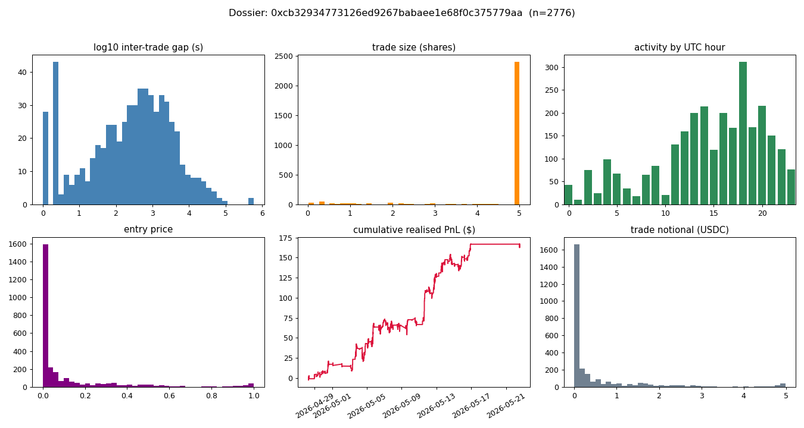

# Dossier — 0xcb32934773126ed9267babaee1e68f0c375779aa

*Type:* wallet | *member wallets:* 1 | *bot_score:* 0.73

## Summary stats
- Trades: **2776** | Volume: **$1,452** | Realised PnL (resolved): **$166** (ROI 11.5%)
- Fill win rate: **0.90** | Breadth: **206 markets** | Active hours: **24/24**
- Active period: 2026-04-29T12:00:00Z … 2026-05-29 | resolution-day trade share: 89%

## Inferred strategy archetype: **Systematic fair-value maker/taker**  _(confidence: medium-high)_

## Evidence

| signal | value |
|---|---|
| breadth (markets) | 206 |
| active UTC hours | 24/24 |
| cadence cv_gap (min) | 7.226 |
| max fills / second | 20 |
| median size (shares) | 5.0 |
| mode-size fraction | 0.86 |
| reaction alignment | 0.74 |
| resolution-day share | 89% |
| fill win rate | 0.90 |
| ROI on resolved | 0.115 |

Triggers fired: breadth 206 markets, 24/24 active hours, win rate 0.90, thin ROI 0.115, reaction alignment 0.74, 89% trades on resolution day, mode-size frac 0.86, extreme-price frac 0.67

## Estimated edge source
- High breadth + high win rate + thin ROI ⇒ edge is **many small, high-probability fills** (spread/fair-value capture across all buckets), not a few large directional bets.
## Inferred sizing & timing model _(described, not exact)_
- **Sizing:** median ~5 shares; mode-size fraction 0.86 (fixed-size ladder).
- **Timing:** 24/24 active, up to 20 fills/second ⇒ automated, polling-driven; cadence regularity (cv_gap 7.23).
## Weaknesses / exploitable angles
- Taker-side data hides maker quote/cancel churn — adverse-selection windows are not directly measured here (forward live capture, Phase 8).
- Reaction alignment is measured against an **hourly** reference; any sub-hour staleness after a temperature move is invisible to this proxy.
- High breadth ⇒ thin per-market attention; illiquid buckets / off-peak UTC hours are candidate coverage gaps (quantified in exploits.md).

_Caveats: taker-side only; maker fraction/adverse-selection unavailable; reaction coarse (hourly); operator membership via co-timing._
