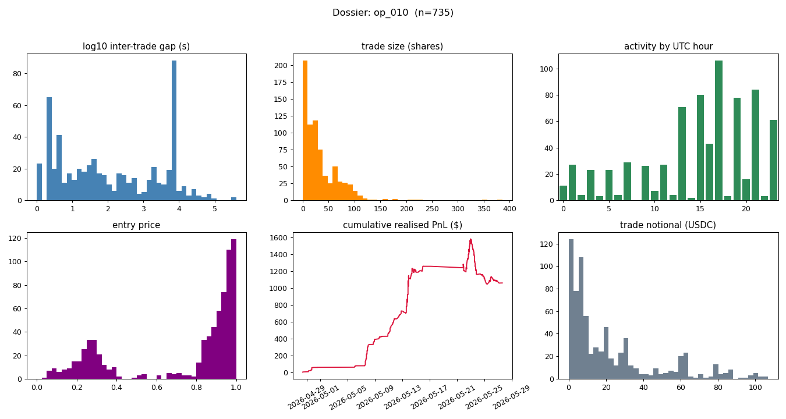

# Dossier — op_010

*Type:* operator | *member wallets:* 2 | *bot_score:* 0.57

## Summary stats
- Trades: **735** | Volume: **$16,278** | Realised PnL (resolved): **$1,058** (ROI 7.3%)
- Fill win rate: **0.70** | Breadth: **100 markets** | Active hours: **22/24**
- Active period: 2026-04-29T12:00:00Z … 2026-05-29 | resolution-day trade share: 14%

## Inferred strategy archetype: **Systematic high-breadth trader (maker/taker indistinct)**  _(confidence: medium)_

## Evidence

| signal | value |
|---|---|
| breadth (markets) | 100 |
| active UTC hours | 22/24 |
| cadence cv_gap (min) | 3.136 |
| max fills / second | 7 |
| median size (shares) | 17.1 |
| mode-size fraction | 0.11 |
| reaction alignment | 0.31 |
| resolution-day share | 14% |
| fill win rate | 0.70 |
| ROI on resolved | 0.073 |

Triggers fired: breadth 100 markets, 22/24 active hours, thin ROI 0.073

## Estimated edge source
- High breadth + high win rate + thin ROI ⇒ edge is **many small, high-probability fills** (spread/fair-value capture across all buckets), not a few large directional bets.
## Inferred sizing & timing model _(described, not exact)_
- **Sizing:** median ~17 shares; mode-size fraction 0.11 (variable).
- **Timing:** 22/24 active, up to 7 fills/second ⇒ automated, polling-driven; cadence regularity (cv_gap 3.14).
## Weaknesses / exploitable angles
- Taker-side data hides maker quote/cancel churn — adverse-selection windows are not directly measured here (forward live capture, Phase 8).
- Reaction alignment is measured against an **hourly** reference; any sub-hour staleness after a temperature move is invisible to this proxy.
- High breadth ⇒ thin per-market attention; illiquid buckets / off-peak UTC hours are candidate coverage gaps (quantified in exploits.md).

_Caveats: taker-side only; maker fraction/adverse-selection unavailable; reaction coarse (hourly); operator membership via co-timing._
